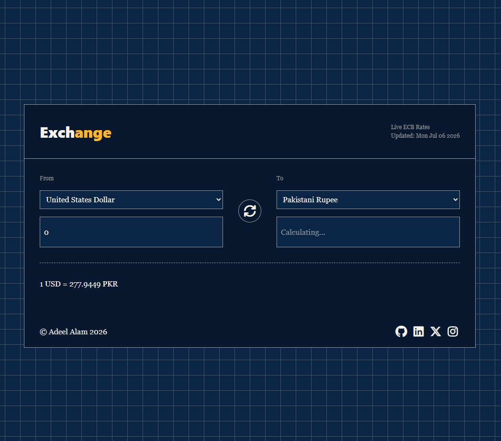
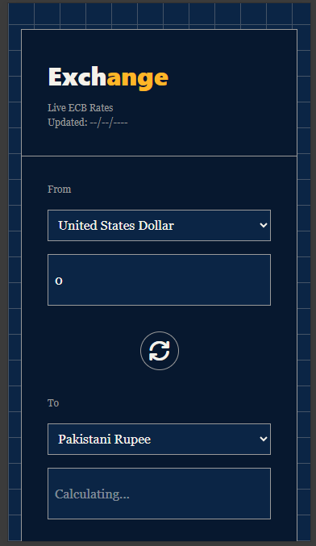

# 💱 Currency Exchange App

A modern and responsive currency converter built with **HTML, JavaScript, Tailwind CSS, and Vite**. The application fetches real-time exchange rates from **ExchangeRate-API**, allowing users to quickly convert amounts between multiple international currencies.

🔗 **Live Demo:** https://currency-exchange-app-30o.pages.dev//

---

## ✨ Features

* 🌍 Convert between multiple international currencies
* 📈 Real-time exchange rates powered by ExchangeRate-API
* 🔄 One-click currency swap functionality
* 💰 Instant conversion as you type
* 📅 Displays the last updated exchange rate date
* 🏳️ Displays country and currency names for easy selection
* 📱 Responsive design for desktop and mobile devices
* ⚠️ User-friendly error handling for network and API failures

---

## 🛠️ Tech Stack

* HTML5
* JavaScript (ES6+)
* Tailwind CSS
* Vite
* Font Awesome
* ExchangeRate-API

---

## 📸 Screenshot

> Add a screenshot of the application here.

```markdown


```

---

## 🚀 Getting Started

### Prerequisites

* Node.js
* npm

### Installation

Clone the repository:

```bash
git clone https://github.com/Adeel-Alam-Git/Currency-Exchange-App.git
cd Currency-Exchange-App
```

Install dependencies:

```bash
npm install
```

Create a `.env` file in the project root and add your ExchangeRate-API key:

```env
VITE_EXCHANGE_API_KEY=your_api_key
```

Start the development server:

```bash
npm run dev
```

Create a production build:

```bash
npm run build
```

---

## 🌐 API

This project uses **ExchangeRate-API** to retrieve live currency exchange rates.

A free API key can be obtained from the ExchangeRate-API website.

---

## 📚 What I Learned

While building this project, I gained hands-on experience with:

* Working with REST APIs using the Fetch API
* Asynchronous JavaScript (`async` / `await`)
* Error handling using `try...catch` and custom error classes
* DOM manipulation and event-driven programming
* Debouncing user input for better performance
* Building responsive user interfaces with Tailwind CSS
* Modern frontend tooling with Vite
* Environment variables for securing API keys
* Deploying a production-ready application

---

## 🚀 Deployment

The application is deployed using **Cloudflare Workers** and optimized for production using Vite's build process.

---

## 📄 License

This project is licensed under the MIT License.

Feel free to fork, modify, and use it for learning or personal projects.
